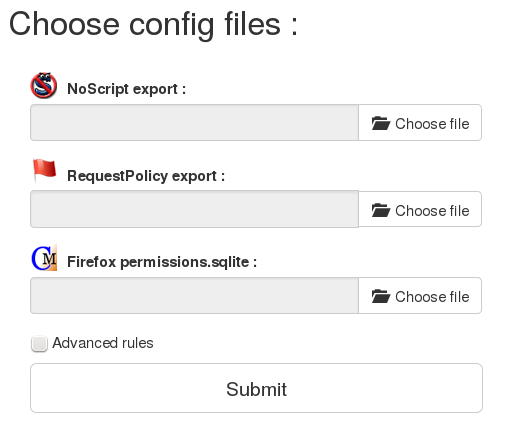

A project for Firefox addons that allows to convert CookieMonster, RequestPolicy and NoScript configurations to uMatrix.

Since Firefox encourages the removal of many addons during migration to the new secure API
named webextensions, online privacy management appears to be partially compromised
by loosing some critical addons, or at least, time-consuming when you have to reconfigure new addons.

This project written in Python proposes to convert firewall and management rules built by two addons that were very useful
([CookieMonster](https://addons.mozilla.org/nn-NO/firefox/addon/cookie-monster/) and [RequestPolicy](https://addons.mozilla.org/fr/firefox/addon/requestpolicy/))
to rules made for a new all-in-one addon: [uMatrix](https://addons.mozilla.org/fr/firefox/addon/umatrix/).

Moreover, this project allows to uses uMatrix easily in conjonction or replacement
of the JavaScript blocker [NoScript](https://addons.mozilla.org/fr/firefox/addon/noscript/).

# Installation

## Core

For the webserver you have to install all given Python requirements (in a virtualenv for exemple):

    pip3 install -r requirements.txt

*Note:* For the basic script `uMatrix_converter.py`, only SQLAlchemy is required.

## Nginx

Here you will find an example of Nginx configuration host which is largely based on
the documentation of [Gunicorn](http://docs.gunicorn.org/en/stable/deploy.html).

    :::nginx
    # Flask proxy config for umatrix interface
    location @proxy_to_umatrix {
        # enable this if and only if you use HTTPS
        proxy_set_header X-Forwarded-Proto https;
        proxy_set_header   Host             $http_host;

        proxy_set_header   X-Forwarded-For   $proxy_add_x_forwarded_for;
        proxy_set_header   X-Forwarded-Proto $scheme;

        # we don't want nginx trying to do something clever with
        # redirects, we set the Host: header above already.
        proxy_redirect     off;

        # Filter static files
        try_files $uri $uri/ @backend;

        location @backend {
            proxy_pass http://umatrix_server;
        }
    }

    upstream umatrix_server {
            server unix:/run/umatrix.sock fail_timeout=0;
    }

## Install the service at system-wide

A Systemd script is provided in order to facilitate the configuration of the web interface as a service.

    :::ini
    [Unit]
    Description=uMatrix Converter
    #Requires=network.socket
    After=network.target

    [Service]
    PIDFile=/run/umatrix.pid
    Group=www-data
    WorkingDirectory=/project/directory
    Environment="PATH=/usr/local/bin"
    ExecStart=/usr/local/bin/gunicorn --access-logfile /var/log/umatrix/access.log --error-logfile /var/log/umatrix/error.log --timeout 13 --workers 1 --pid /run/umatrix.pid --bind unix:/run/umatrix.sock -m 007 website:app
    ExecReload=/bin/kill -s HUP $MAINPID
    ExecStop=/bin/kill -s TERM $MAINPID

    [Install]
    WantedBy=multi-user.target

Change `Environment` key and change the path of gunicorn if you plan to work in a virtualenv.
Apart from this, the installation of the service (in `/etc/systemd/system/umatrix-converter.service`) can be made with the following command:

    make install

The uninstall can be made with the following command:

    make uninstall

Commands for the administration of the service are:

    - systemctl start umatrix-converter.service
    - systemctl stop umatrix-converter.service
    - systemctl restart umatrix-converter.service

## Configuration

All the settings are located in the `commons.py` file.

# How to use it ?

## Files required

We need 3 optional files; 2 from actual-addons and 1 from Firefox itself (See *How does it work ?*)

- No Script export;
You can obtain it with a click on its icon, then `White list` tab then click on `export button`;

- Request Policy export;
Go to about:addons, click on "preferences" in front of "RequestPolicy", then click on "Export" tab, and on the button "Export to file"

- Firefox permissions database: `permissions.sqlite`;
You can obtain it in your browser profile folder: `~/.mozilla/firefox/????.default/` on GNU/Linux or `%APPDATA%\Mozilla\Firefox\Profiles\????.default/`on Windows.

## Stand-alone script

The script offers 3 parsers (one for each kind of supported files):

- RequestPolicyParser
- NoScriptParser
- FirefoxPermissionsParser

Each of them has a `read_file` that can parse the given file.

Then, 3 converters are responsible for the conversion to uMatrix rules:

- request_policy_converter
- noscript_converter
- cookie_monster_converter

Each of them takes a parser and an output file.

A basic use is:

    :::python
    config = FirefoxPermissionsParser()
    config.read_file('data/permissions.sqlite')
    cookie_monster_converter(config, 'data/uMatrix-rules.txt')

    config = RequestPolicyParser()
    config.read_file('data/requestpolicy-settings.txt')
    request_policy_converter(config, 'data/uMatrix-rules.txt', advanced=True)

    config = NoScriptParser()
    config.read_file('data/noscript_whitelist_export.txt')
    noscript_converter(config, 'data/uMatrix-rules.txt')

*Note:* Request policy parser takes an additional argument, explained in *How does it work ?* section.

## Website

Without any server you can test the website locally with the command:

    make dev_flask_start

Then, go to your web browser at the url: http://127.0.0.1:4000/umatrix-converter

The website is a basic form where you can upload your files and get uMatrix rules at the end of the process.

## Import into uMatrix

In Firefox, go to "Tools" menu, then "addons", then find uMatrix, click on "preferences";
at the bottom of the page you will see "Go to dashboard".

Then go to "My rules" tab, and click on the button "Import from file", then choose your `uMatrix-rules.txt`.

You will have to apply rules by clicking on the button "Apply".

# How does it work ?

## Cookie Monster conversion

Since Cookie Monster is a wrapper of Firefox features, we need
to get data from `permissions.sqlite`.

We only use informations about the cookies status; Here you will see the SQL query:

    :::SQL
    SELECT origin, permission FROM moz_perms WHERE type == \'cookie\'

We make *allow* rules with allowed cookies, and *block* rules with cookies that are blocked and blocked for the current session.

## NoScript conversion

Basic rules of NoScript are *allow* rules, others are explicitly *block* rules.
Since NoScript doesn't work with **the notion of context**, rules are restricted to **allow hosts on themselves** and **block hosts from everywhere**.

i.e:

- If NoScript allows `01net.com`, uMatrix rule will be: `01net.com 01net.com script allow`.
- If NoScript blocks `newrelic.com`, uMatrix rule will be: `* newrelic.com script block`.
So no one site will be able to join newrelic.com.

## RequestPolicy conversion

RequestPolicy has 3 types of rules:

- *Origins*; Converted as `origin * * allow`.
- *Origins-to-destinations*: Converted as `origin destination * allow`.
- *Destinations*: Converted as `* destination * allow`.

These rules **can be considered too permissive and do not take enough advantage of the power of uMatrix**;
so an advanced mode is available:

- *Origins*; No conversion (We don't make rules that allow all types of requests on a website).
- *Origins-to-destinations*: Converted as `origin destination xhr allow` and `origin destination script allow` (We allow only scripts and ajax queries to another website).
- *Destinations*: Converted as `* destination xhr allow` (We only accept ajax queries to another website).
